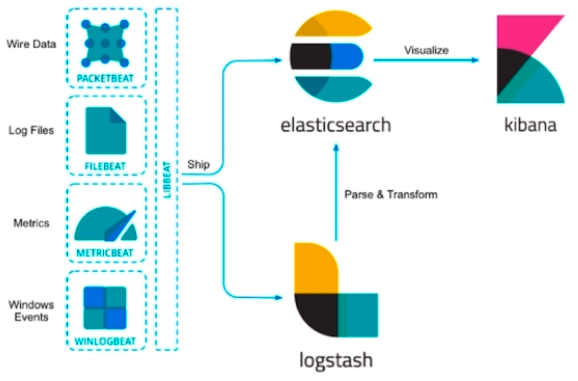
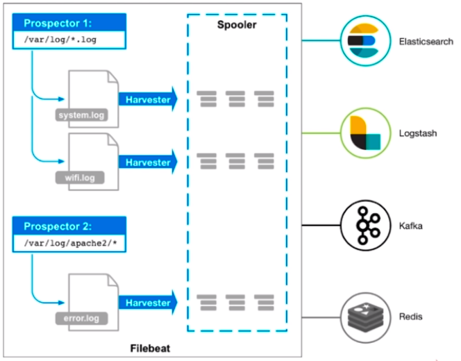

## [Elasticsearch](https://www.elastic.co/guide/en/elasticsearch/reference/current/index.html)
>### 参考网站 & 问题
>1. [高性能elasticsearch ORM开发库使用介绍](https://my.oschina.net/bboss/blog/1556866)
>2. [windows安装elasticsearch和elasticsearch-head插件](https://www.cnblogs.com/nicknailo/p/9014952.html)
>2. [elasticsearch aggregation](https://www.jianshu.com/p/5deec629ee4f)
>3. [elasticsearch 多字段聚合](https://blog.csdn.net/weixin_41279060/article/details/78852704)
>---
>### Elasticsearch 配置说明
>```
>cluster.name               集群名称，以此作为是否同一集群的判断条件
>node.name                  节点名称，以此作为集群中不同节点的区分条件
>network.host/http.port     网络地址和端口，用于 http 和 transport 服务使用
>path.data                  数据存储地址
>path.log                   日志存储地址
>```
>---
>### Elasticsearch 模式
>以 transport 的地址是否绑定在 localhost 为标准，network.port 是否为 localhost(127.0.0.1)
>
>| |network.host|配置检查异常提示|
>|:---|:---:|:---:|
>|Development|127.0.0.1|warning|            
>|Production|其它|error|
>---
>### Elasticsearch 本地启动集群的方式
>```
>1. bin/elasticsearch                                                       集群-主
>2. bin/elasticsearch -Ehttp.port=8200 -Epath.data=node2                    集群-从1
>3. bin/elasticsearch -Ehttp.port=7200 -Epath.data=node3                    集群-从2
>```
>---
>### [Elasticsearch REST APIs](https://www.elastic.co/guide/en/elasticsearch/reference/current/rest-apis.html)
>```
>_cat                                           查看支持的命令
>   =^.^=
>   /_cat/allocation
>   /_cat/shards
>   /_cat/shards/{index}
>   /_cat/master
>   /_cat/nodes                                 返回关于集群节点的信息
>       /_cat/nodes/v                           返回关于集群节点的信息(包括列名)
>   /_cat/tasks
>   /_cat/indices                               返回关于集群中索引的高级信息
>   /_cat/indices/{index}
>   /_cat/segments
>   /_cat/segments/{index}
>   /_cat/count
>   /_cat/count/{index}
>   /_cat/recovery
>   /_cat/recovery/{index}
>   /_cat/health
>   /_cat/pending_tasks
>   /_cat/aliases
>   /_cat/aliases/{alias}
>   /_cat/thread_pool
>   /_cat/thread_pool/{thread_pools}
>   /_cat/plugins
>   /_cat/fielddata
>   /_cat/fielddata/{fields}
>   /_cat/nodeattrs
>   /_cat/repositories
>   /_cat/snapshots/{repository}
>   /_cat/templates
>
>/_cluster/stats                                返回集群数据                       
>```
>---
>### Elasticsearch CRUD
>- Create
>```
>POST   /accounts/person/1
>{
>  "name": "John",
>  "lastname": "Doe",
>  "job_description": "Systems administrator and Linux specialit"
>}
>```
>- Read
>```
>GET    /accounts/person/1
>```
>- Update
>```
>POST   /accounts/person/1/_update
>{
>  "doc": {
>    "job_description": "Systems administrator and Linux specialit"
>  }
>}
>```
>- Delete
>```
>DELETE /accounts/person/1
>DELETE /accounts
>```
>---
>### Elasticsearch Query
>1. [Query String](https://www.elastic.co/guide/en/elasticsearch/reference/current/query-dsl-query-string-query.html)
>   ```
>   GET /accounts/person/_search?q=john
>   ```
>2. [Query DSL](https://www.elastic.co/guide/en/elasticsearch/reference/current/query-dsl.html)
>   ```
>   GET /accounts/person/_search
>   {
>     "query": {
>       "match": {
>         "name": "john"
>       }
>     }
>   }
>   
>   GET /accounts/person/_search
>   {
>     "query": {
>       "term": {
>         "name": {
>           "value": "alfred"
>         }
>       }
>     }
>   }
>   ```
>---
## [Kibana](https://www.elastic.co/guide/en/kibana/current/index.html)
>## Kibana 配置说明
>```
>server.host/server.port            访问 kibana 用的地址和端口
>elasticsearch.url                  待访问 elasticsearch 的地址
>```
>---
>## Kibana 常用功能说明
>- Discover 数据搜索查看
>- Visualize 图标制作
>- Dashboard 仪表盘制作
>- Timelion 时序数据的高级可视化分析
>- DevTolls 开发者工具
>- Management 配置
>---
## [Beats](https://www.elastic.co/guide/en/beats/libbeat/current/index.html)
- Lightweight Data Shipper 轻量级数据托运人
    - FileBeat 日志文件
    - MetricBeat 度量数据
    - PacketBeat 网络数据
    - WinlogBeat Windows 数据
    - HeartBeat 健康数据



---
>### FileBeat
>>#### 处理流程
>>- 输入 Input
>>- 处理 Filter
>>- 输出 Output
>>
>>      
>>
>>---
>>#### 配置简介 
>>- FileBeat Input
>>  - yaml 语法
>>  - input_type: log / stdin
>>```
>>filebeat.prospectors:
>>- input_type:log
>>  paths:
>>      - /var/log/apache/httpd-*.log
>>- input_type:log
>>  paths:
>>      - /var/log/messages
>>      - /var/log/*.log
>>```
>>- FileBeat Output: Console, Elasticsearch, Logstash, Kafka, Redis, File ...
>>```
>>output.elasticsearch:
>>host: ["http://localhost:9200"]
>>username: "admin"
>>password: "s3cr3t"
>>```
>>```
>>output.console:
>>pretty.true
>>```
>>- FileBeat Filter
>>  - Input 时处理
>>      - Include_lines
>>      - exclude_lines
>>      - exclude_files
>>  - Output 前处理 --Processor
>>      - drop_event
>>      - drop_fields
>>      - Decode_json_fields
>>      - Include_fields
>>```
>>processors:
>>- drop_event:
>>  when:
>>      regexp:
>>          message: "^DBG:"
>>```
>>```
>>processors:
>>- decode_json_fields:
>>  fields: ["inner"]
>>```
>>---
>>#### ElasticSearch Ingest Node
>>因为 FileBeat 缺乏数据转换的能力，所以使用 ElasticSearch Ingest Node
>>- 5.x 新增的 node 类型
>>- 在数据写入 es 前对数据进行处理转换
>>- pipeline api
>>---
>>#### FileBeat Module
>>- 对于社区常见需求进行配置封装增加易用性：nginx, apache, mysql
>>- 封装内容
>>  - filebeat.yml 配置
>>  - ingest node pipeline 配置
>>  - kibana dashboard
>>- 最佳实践参考
>>---
>>#### 收集 nginx log
>>- 配置文件：nginx.yml
>>```
>>filebeat.prospectors:
>>- input_type: stdin
>>output.console:
>>  pretty: true
>>```
>>- 执行命令：head -n 2 ./nginx_logs|./filebeat -e -c ./nginx.yml
>>---
>### PacketBeat
>- 实时抓取网络包
>- 自动解析应用层协议：ICMP (v4 and v6), DNS, HTTP, Mysql, Redis ...
>- 相当于轻量级的 Wireshark
>---
>>#### PacketBeat 解析 HTTP 协议
>>- 解析 elasticsearch http 请求，配置文件：es.yml
>>```
>>packetbeat.interaces.device: lo0
>>packetbeat.protocols.http: 
>>  ports:[9200]
>>  send_request: true
>>  include_body_for: ["application/json", "x-www-form-urlencoded"]
>>output.console:
>>  pretty:true
>>```
>>- 执行命令：sudo ./packetbeat -e -c ./es.yml -strict.perms=false
>>---
## [Logstash](https://www.elastic.co/guide/en/logstash/current/index.html)
- Data Shipper 数据托运人
    - ETL
    - Extract
    - Transform
    - Load
---
>### 处理流程
>- Input: file, redis, beats, kafka ...
>- Filter: grok, mutate, drop, date ...
>- Output: stdout, elasticsearch, redis, kafka ...
>### 配置
>- 处理流程配置
>```
>input { file { path => "/tmp/abc.log" } }
>
>output { stdout { codec => rubydebug } }
>```
>- Filter 配置
>   - Grok：基于正则表达式提供了丰富可重用的模式 (pattern)，基于此可以将非结构化数据作结构化处理
>   ```
>   日志： 55.3.244.1 GET /index.html 15824 0.043
>   
>   配置：%{IP:client} %{WORD:method} %{UPDATEPARAM:request} %{NUMBER:bytes} %{NUMBER:duration}
>   
>   结果： {
>           "client: "55.3.244.1",
>           "request": "GET",
>           "bytes": 15824,
>           "duration": 0.043
>         }
>   ```
>   - Date：将字符串类型的时间字段转换为时间戳类型，方便后续数据处理
>   - Mutate：进行增加，修改，删除，替换等字段相关的处理
>   - ...
>### 收集 nginx log
>执行命令：head -n 2 ./nginx_logs|./bin/logstash -f ./config/nginx_logstash.conf
>
>---
## 实战
>### 目标
>- 收集 Elasticsearch 集群的查询语句
>- 分析查询语句的常用语句、响应时长等
>---
>### 方案
>- 应用 PacketBeat + Logstash 完成数据收集工作
>- 使用 Kibana + Elasticsearch 
>
>
>### 集群
>- Production Cluster
>   - Elasticsearch http://127.0.0.1:9200
>   - kibana http://127.0.0.1:5601
>- Monitoring Cluster
>   - Elasticsearch http://127.0.0.1:8200
>       - ./bin/elasticsearch.bat -Ecluster.name=sniff_search -Ehttp.port=8200 -Epath.data=sniff_search -Etransport.tcp.port=9400
>   - kibana http://127.0.0.1:8601
>       - ./bin/kibana.bat -e http://127.0.0.1:8200 -p 8601
>### Logstach 配置
>```
>input { beats { port => 5044 } }
>filter {
>   if "search" in [request] {
>       grok { match => { "request" => ".*\n\{(?<query_body>.*)" } }
>       grok { match => { "path" => "\/(?<index>.*)\/_search" } }
>   if [index] {} else { mutate { add_field => { "index" => "All" } } }
>   mutate { update => { "query_body" => "{ % { query_body }" } } }
>}
>output {
>   if "search" in [request] {
>       elasticsearch { hosts => "127.0.0.1:8200" }
>}
>```
>执行命令：./bin/logstash.bat -f ./config/sniff_search.conf
>
>---
>### PacketBeat 配置
>```
>packetbeat.interfaces.device: lo0
>packetbeat.protocols.http:
>   ports: [9200]
>   send_request: true
>   send_response: false
>   include_body_for: ["application/json", "x-www-form-urlencoded"]
>output:console:
>   pretty: true
>output.logstash:
>   hosts: ["127.0.0.1:5044"]
>```
>执行命令：./packetbeat.exe -e -c ./sniff_search.yml -strict.perms=false
>
>---

